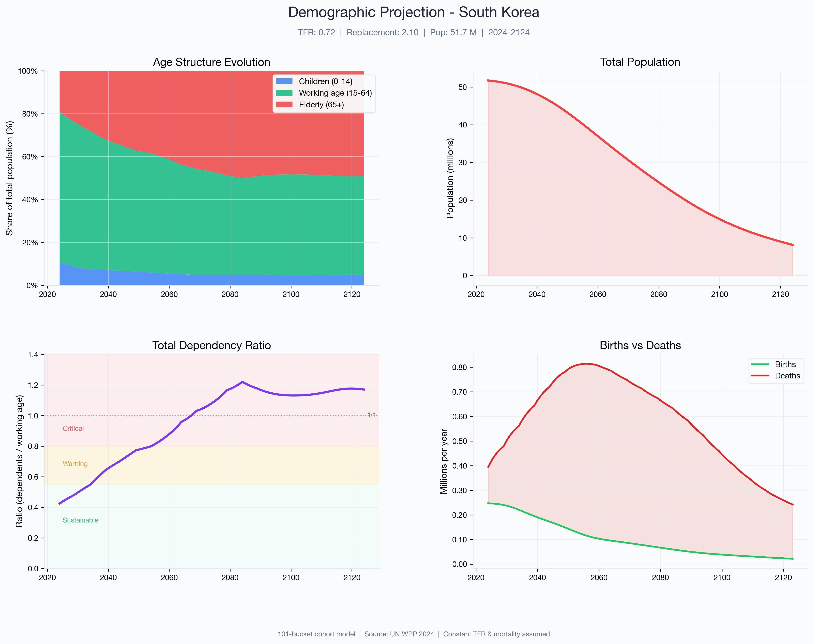
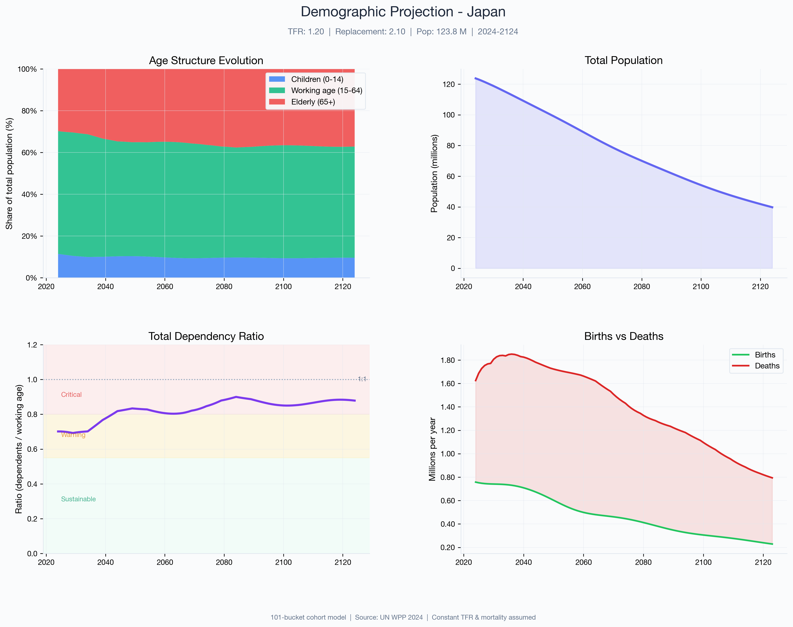
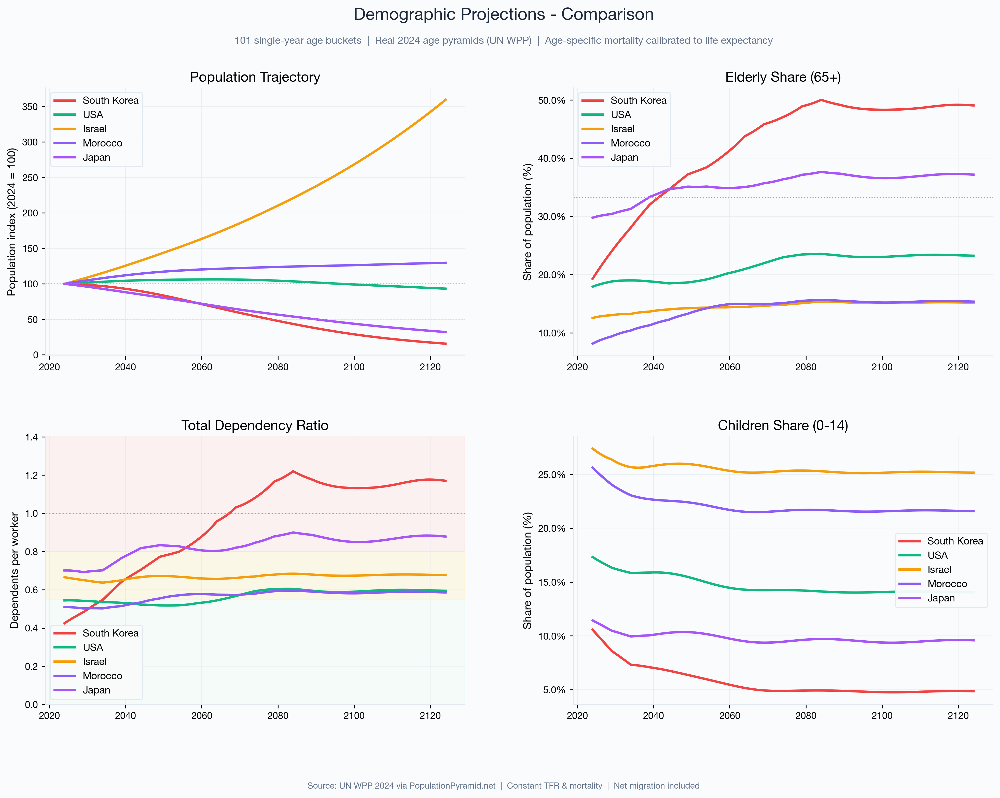
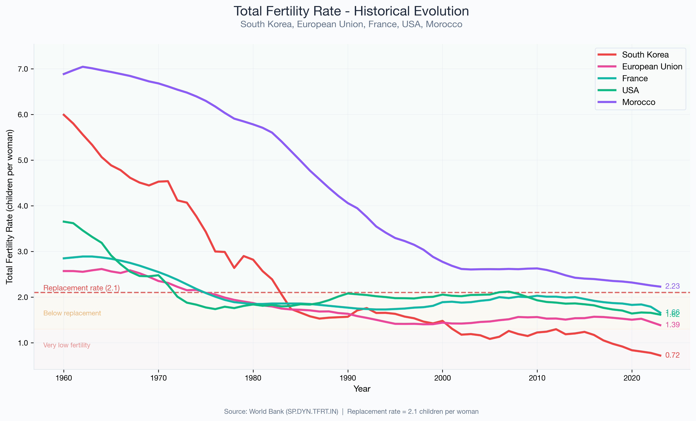

<div align="center">
  <picture>
    
  </picture>
</div>

<p align="center">
  <strong>Cohort-component demographic projection with real UN data</strong>
</p>

<p align="center">
  Data from <a href="https://population.un.org/wpp/">UN WPP 2024</a> and <a href="https://data.worldbank.org/">World Bank</a>
</p>

<p align="center">
  
  
  
  
</p>

---

Fetches actual 2024 age pyramids and indicators for any country from public APIs, then projects population
structure forward using a 101 single-year cohort model under constant fertility/mortality assumptions.



## Features

- **101-bucket cohort model** &mdash; single-year ages 0&ndash;100+, not simplified 3-group bins
- **Real data** &mdash; actual 2024 age pyramids from UN World Population Prospects
- **Any country** &mdash; 230+ countries/territories supported via ISO3 codes or names
- **Local caching** &mdash; fetched data saved to `~/.demoproj/data/` so APIs are hit only once
- **Four CLI commands** &mdash; `fetch`, `project`, `compare`, `history`
- **Publication-quality charts** &mdash; 300 dpi, clean styling, annotated milestones

## Install

```bash
pip install -e .
```

Requires Python 3.10+ with `numpy` and `matplotlib`.

## Quick Start

```bash
# Fetch and cache data for a few countries
demoproj fetch KOR JPN USA ISR MAR FRA DEU ITA

# Single-country projection (4-panel dashboard)
demoproj project "South Korea"

# Compare multiple countries side by side
demoproj compare KOR JPN USA ISR Morocco

# Historical TFR evolution
demoproj history KOR EU France USA Morocco
```

## Commands

### `demoproj fetch`

Download and cache demographic data for one or more countries.

```bash
demoproj fetch KOR JPN FRA USA ISR MAR DEU ITA ESP BRA NGA IND CHN
```

Data is stored in `~/.demoproj/data/<iso3>.json` and reused by other commands automatically.
Accepts ISO3 codes (`KOR`, `JPN`) or country names (`Japan`, `France`, `"South Korea"`).

### `demoproj project`

Generate a 4-panel dashboard for a single country: age structure evolution,
total population trajectory, dependency ratio, and births vs deaths.

```bash
demoproj project Japan
demoproj project KOR --horizon 80
demoproj project Morocco --output-dir ./charts
```

| Flag | Default | Description |
|------|---------|-------------|
| `--horizon` | 100 | Projection horizon in years |
| `--output-dir` | `.` | Where to save the PNG |

**South Korea** (TFR 0.72 &mdash; world's lowest):


**Japan** (TFR 1.20):



### `demoproj compare`

Side-by-side comparison of multiple countries across four metrics:
population trajectory, elderly share, dependency ratio, and children share.

```bash
demoproj compare KOR JPN USA ISR Morocco
demoproj compare                          # all cached countries
demoproj compare --horizon 80
```

| Flag | Default | Description |
|------|---------|-------------|
| `--horizon` | 100 | Projection horizon in years |
| `--output-dir` | `.` | Where to save the PNG |



### `demoproj history`

Plot historical Total Fertility Rate from the World Bank (1960&ndash;present) for
countries or aggregate regions.

```bash
demoproj history KOR EU France USA Morocco
demoproj history World Africa MENA --start 1980
demoproj history Japan "South Korea" --start 1960 --end 2023
```

| Flag | Default | Description |
|------|---------|-------------|
| `--start` | 1960 | Start year |
| `--end` | 2023 | End year |
| `--output-dir` | `.` | Where to save the PNG |

Supported regions: `EU`, `Europe`, `World`, `Africa`, `MENA`, `LATAM`, `Asia`, `SAS` (South Asia), `NAC` (North America).



## How It Works

### Model

Each year of the projection:

1. **Age** the population &mdash; everyone moves up one age bucket
2. **Apply mortality** &mdash; age-specific death rates calibrated to match the country's life expectancy via iterative Gompertz scaling
3. **Compute births** &mdash; TFR distributed across reproductive ages (15&ndash;49) using a Gaussian fertility curve centered on the country's peak fertility age
4. **Apply migration** &mdash; net migration distributed as a bell curve around age 30

All parameters (TFR, life expectancy, net migration rate, age pyramid) come from real data. The projection assumes constant rates &mdash; it answers "what happens if today's fertility and mortality persist?"

### Data Sources

| Indicator | Source | API |
|-----------|--------|-----|
| Age pyramid (5-year groups) | UN WPP 2024 | PopulationPyramid.net |
| Total Fertility Rate | World Bank | `SP.DYN.TFRT.IN` |
| Life expectancy at birth | World Bank | `SP.DYN.LE00.IN` |
| Net migration | World Bank | `SM.POP.NETM` |
| Total population | World Bank | `SP.POP.TOTL` |

5-year age groups are expanded to single-year buckets via linear interpolation.

## Project Structure

```
src/demoproj/
    __init__.py        # Public API re-exports
    cli.py             # CLI entry-point (fetch, project, compare, history)
    countries.py       # ISO3/M49/display-name mapping (230+ countries)
    data.py            # Age-pyramid expansion and parameter loading
    fetch.py           # API fetching, caching, TFR history
    fertility.py       # Gaussian age-specific fertility weights
    model.py           # Core 101-bucket cohort projection engine
    mortality.py       # Gompertz mortality calibration
    plotting.py        # Chart generation (matplotlib)
```

## Python API

```python
from demoproj import ProjectionParams, project, plot_single_country
from demoproj.fetch import get_or_fetch
from demoproj.data import expand_5yr_to_single

cfg = get_or_fetch("Japan")
params = ProjectionParams(
    name=cfg["name"],
    initial_pop=expand_5yr_to_single(cfg["groups"]),
    tfr=cfg["tfr"],
    life_expectancy=cfg["life_expectancy"],
    net_migration_rate=cfg["net_migration_rate"],
    fertility_peak=cfg["fertility_peak"],
    fertility_spread=cfg["fertility_spread"],
)
result = project(params, horizon=80)
fig = plot_single_country(result, save_path="japan.png")

print(f"Population 2024: {result.total[0]/1e6:.1f} M")
print(f"Population 2104: {result.total[-1]/1e6:.1f} M")
print(f"Peak elderly:    {result.pct_elderly.max():.1f}%")
```

## Key Concepts

- **TFR (Total Fertility Rate)**: average children per woman. Replacement level is ~2.1.
- **Dependency ratio**: (children 0-14 + elderly 65+) / working-age 15-64. Above 1.0 means more dependents than workers.
- **Life expectancy at birth**: used to calibrate age-specific mortality via iterative scaling of a Gompertz curve.
- **Net migration rate**: annual net migrants as a fraction of total population, distributed across ages 18-45.

## Assumptions and Limitations

- **Constant rates**: TFR, mortality, and migration are held constant over the projection horizon. Real demographic transitions involve changing rates.
- **No feedback loops**: the model does not account for policy changes, economic shocks, or behavioral responses to demographic shifts.
- **Simplified migration**: net migration is a single scalar distributed by age, not a full origin-destination model.
- **Secular interpolation**: 5-year UN age groups are interpolated to single years; the true single-year distribution may differ slightly.

## License

MIT
